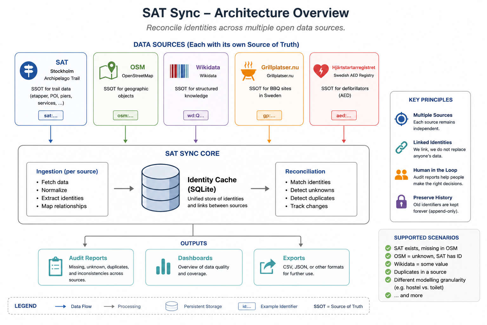

# SAT Sync

SAT Sync helps maintain consistent identities across:

- Stockholm Archipelago Trail (SAT)
- OpenStreetMap (OSM)
- Wikidata

Rather than simply copying data, SAT Sync builds a local identity cache and produces audit reports that highlight differences between the three platforms.

## Why?

Each platform has its own data model, community and release cycle.

As a result, the same real-world object may appear differently:

- present in SAT but missing from OSM
- tagged as `ref:stockholmarchipelagetrail=unknown` in OSM
- represented as `some value` in Wikidata
- duplicated in OSM (for example a building and an entrance)
- modelled with different levels of detail (for example a hostel versus its individual toilets and showers)

These are not necessarily errors—they are often consequences of independent communities maintaining independent datasets.

SAT Sync helps identify these situations so they can be reviewed by people.

## Goals

- Maintain a local identity cache.
- Compare identities across SAT, OSM and Wikidata.
- Detect missing, unknown and duplicate identities.
- Produce audit reports for human review.
- Support collaborative maintenance of linked open data.

## Philosophy

Linked data is not just about linked identifiers.

**Linked data needs linked people.**

SAT Sync is designed to support collaboration between communities rather than attempting to force different data models into a single "correct" representation.

**Every source remains the Source of Truth for its own domain.**

sat-sync does not replace those sources.
It maintains an identity cache that links them together and produces audit reports highlighting missing, unknown and inconsistent identities across open data platforms.
